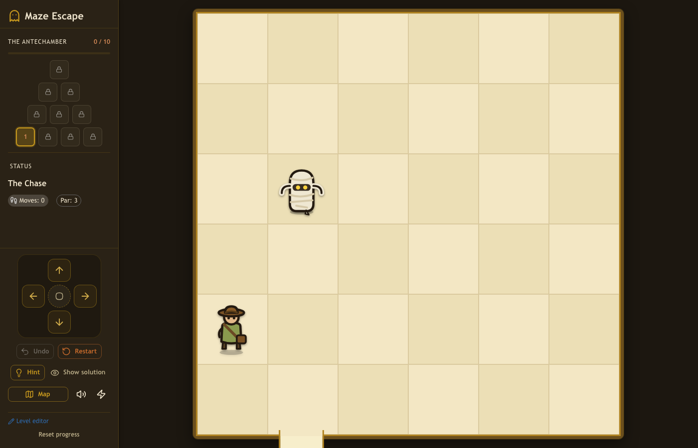

# Maze Escape

A turn-based grid pursuit-maze puzzle. An explorer must reach the maze exit while deterministic monsters hunt them down. The monsters are fast (mummies take two steps per turn, scorpions one) but perfectly predictable: each one greedily steps toward you along a fixed axis priority (white monsters go horizontal-first, red monsters vertical-first) and never voluntarily steps away. You win not by out-running them but by out-thinking their pathing, luring them into walls, traps, or each other. Every level is a solvable puzzle with a known shortest solution.



## Clean-room / legal note

This is an original, from-scratch reimplementation of the *genre's* mechanics for personal, offline play. All code and assets are original: the character sprites are hand-drawn SVG, the sound effects are synthesized at runtime with the Web Audio API, and every level layout is generated or hand-authored here. Game rules and mechanics are not copyrightable; only specific expression (art, audio, level data, names, logos) is. This project does not use, and is not affiliated with, any specific commercial game's name, branding, artwork, audio, or level data.

## Features

- **Deterministic pure engine.** The whole simulation is a pure function of state plus a player action. No randomness in turn resolution, so outcomes are reproducible, undo is exact, and the engine is trivially unit-testable. Lives in `src/engine/` with no React imports.
- **Exact solver and difficulty scoring.** A BFS over game states finds the shortest winning move sequence (`solve`), which sets each level's `par`. A difficulty scorer rates layouts for ordering and validation.
- **Seeded build-time level generator.** A reproducible mulberry32-seeded generator draws candidate boards and keeps only those that pass machine-checkable quality filters: an anti-trivial "beeline" filter (a naive player who walks the shortest path ignoring enemies must *lose*), a threat-proximity filter (the nearest enemy must start close, no far-corner idlers), solver-verified solvability, and `par` greater than the straight-line distance.
- **Teaching curriculum.** Levels introduce one mechanic at a time (fast mummy juke, then walls, traps, red monsters, two hunters, forced merges, scorpions, keys and gates) with the enemy always close and threatening.
- **Pyramids.** Levels are organized into themed pyramids of 10, laid out as rows of 4 / 3 / 2 / 1 and climbed base to apex as difficulty rises. Multiple pyramids are stitched into a world map, and the pack is extensible.
- **Step-by-step animation.** Sprites interpolate between tiles while the authoritative state jumps instantly; input is ignored during the brief monster-move animation. Winning plays a real walk-out through the exit gap. Bumping a wall wastes the turn.
- **Hints and solutions.** One free hint per level, plus a full solver-generated solution reveal.
- **Synthesized audio and toggles.** Web Audio sound effects with no audio files, plus mute and animation toggles.
- **Progression via localStorage.** Level unlocks, best-move counts, completion, resume-where-you-left-off, and settings persist locally and degrade gracefully to memory if storage is unavailable.
- **Web-based level editor.** Paint walls, gates, keys, traps, monsters, start, and exit on a grid with live solvability, par, and difficulty readouts, plus JSON export and import.
- **Responsive layouts** for desktop and mobile.

## Getting started

```bash
npm install
npm run dev      # dev server on http://localhost:5180
npm run build    # type-check and production build
npm test         # Vitest engine + game unit tests
```

## Controls

- **Move:** arrow keys or WASD, or the on-screen D-pad.
- **Wait:** Space or `.` (staying put is a legal, essential move for baiting monsters).
- **Undo:** `U`. **Restart:** `R`.
- **Hint** reveals the next move; **Show solution** reveals the full solver path.
- **Map** opens the world map of pyramids.

## Level format and editor

Levels are compact `LevelSpec` JSON authored as sparse lists rather than a fully expanded grid. Walls and gates are edge entries (`{ x, y, dir }`, gates add `open`), keys and traps are cell entries (`{ x, y }`), monsters carry a `kind` and position, and the exit is a single border edge. A loader (`src/engine/level.ts`) validates and expands each spec at load time (in-bounds coordinates, symmetric walls, exit on the border) and fails fast on bad data.

```json
{
  "id": "01-the-chase",
  "name": "The Chase",
  "width": 6,
  "height": 6,
  "start": { "x": 0, "y": 4 },
  "exit": { "x": 1, "y": 5, "dir": "S" },
  "monsters": [{ "kind": "mummy_white", "x": 1, "y": 2 }],
  "par": 3
}
```

Monster kinds are `mummy_white`, `mummy_red`, `scorpion_white`, and `scorpion_red`. Levels live in `src/levels/*.json` and are grouped into pyramids by `src/levels/pyramids.ts` (a config layer that only references level ids and never edits the JSON). Build or tweak levels visually at `/editor`, which shows live validation and exports the same JSON.

## The generator CLI

The level pack is produced at build time only; there is no runtime generation.

```bash
node scripts/generate-levels.mjs generate      # rebuild the curated pack from scratch
node scripts/generate-levels.mjs extend <N>    # append N solver-verified levels
```

`generate` replaces the pack (hand-authored teaching levels plus generated combinations) and rewrites `src/levels/index.ts`. `extend <N>` reads the existing pack and appends N new levels that pass the same curriculum filters, on progressively bigger and busier boards, without renumbering existing files. Both drive the exact same solver, difficulty scorer, and curriculum filters that the tests use.

## Tech stack

Vite, React 19, TypeScript, MUI v9, lucide-react, react-router, and Vitest.

## Project structure

```
src/
  engine/       Pure, framework-agnostic game logic (no React)
    types.ts        Core data model
    board.ts        Geometry, canCross, neighbor math
    monsters.ts     Greedy pursuit + collision resolution
    step.ts         Turn orchestration and win/lose checks
    level.ts        LevelSpec loader and validator
    solver.ts       BFS shortest-solution search
    difficulty.ts   Layout difficulty scoring
    generator.ts    Seeded generator + curriculum filters
  levels/       *.json levels, index.ts registry, pyramids.ts grouping
  game/         React hooks + services (animation, hints, progress, storage, sound, settings)
  components/   Board, Controls, sidebar, editor, SVG character sprites
  pages/        GamePage, MapPage, EditorPage, PlaytestPage
scripts/
  generate-levels.mjs   Build-time pack generator CLI
docs/
  SPEC.md       Full mechanics, data model, engine API, design rulings
  solutions/    Solver-generated per-level solutions
```

## More

See [docs/SPEC.md](docs/SPEC.md) for the full mechanics, data model, engine API, and the documented rulings on edge cases (collision survivor, monster move order, gate timing). Solver-generated walkthroughs live in [docs/solutions/](docs/solutions/).
</content>
